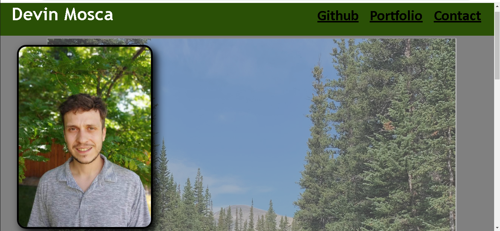

# Devin's Portfolio 2021

## Description

This projects goal was to showcase my understanding of advanced CSS concepts. This portfolio will have links to deployed projects that future employers will be able to have access to. It also has a link to my Github account for further examples of my work and skillset in regards to web development. Overall the main thing I learned completeing this assignment was proper layout of a webpage and proper webpage responsivness. 

## Tasks completed
- Included my name, a recent photo, and links to sections about me, my work, and how to contact me
- After clicking one of the links in the navigation then the UI scrolls to the corresponding section
- After clicking on the link to the section about my work then the UI scrolls to a section with titled    images of my applications
- When presented with my first application then that application's image will be larger in size than the others
-  When the images of the applications are clicked then you are taken to that deployed application
- WHEN resizing the page or view the site on various screens and devices then you are presented with a responsive layout that adapts to the viewport

## To view the website 
Click on provided links:
- [Deployed URL](https://dmosca2021.github.io/dm_portfolio_2021)
- [Repo URL](https://github.com/DMosca2021/dm_portfolio_2021)

## Example of website
Website can be viewed in a typical desktop web browser. It is responsive to screens as small as 576px. 

    

## Credits
Credit for this project goes to my instructor, teachers assistant, and fellow students in the DUbootcamp who provided the information and resources I needed to complete this task.

- [Professional README guide](https://coding-boot-camp.github.io/full-stack/github/professional-readme-guide)
- [W3 Schools CSS Buttons](https://www.w3schools.com/css/css3_buttons.asp)
- [W3 Schools Media Queries](https://www.w3schools.com/css/css3_mediaqueries.asp)